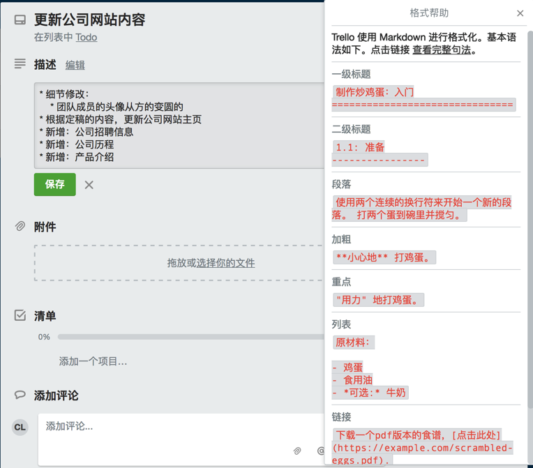
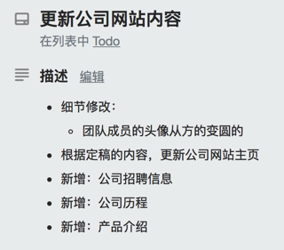

# 其他支持Markdown的工具

## Postman中支持markdown

详见：

[给接口添加描述 · API开发利器：Postman](https://crifan.github.io/api_tool_postman/website/postman_func_req/add_api_desc.html)

## Trello中描述支持markdown

[How To Format Your Text in Trello - Trello Help](https://help.trello.com/article/821-using-markdown-in-trello)

举例：

保存后的效果：

