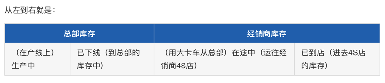
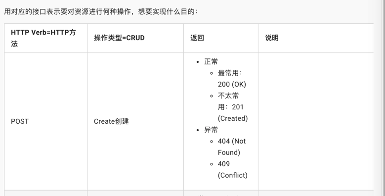
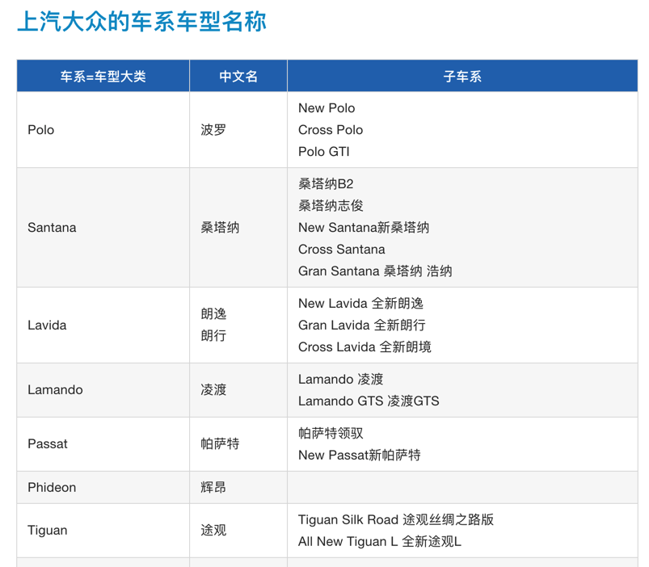
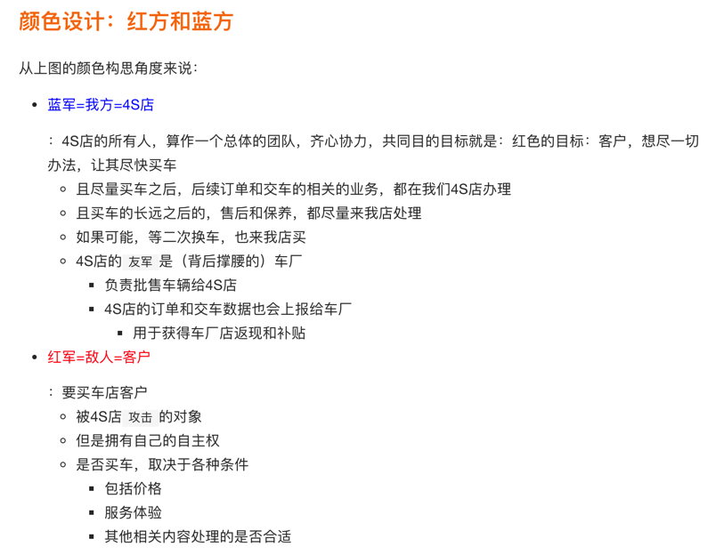

# Markdown心得和坑

## 代码段中包含反引号的代码段

整段代码：

* 三个反引号 ` ``` ` 开始
* 三个反引号 ` ``` ` 结束

比如：

````markdown
```javascript
$(document).ready(function () {
    alert('hello world');
});
```
````

后来才知道，不是一定是3个反引号，而是前后一致就可以：

【已解决】markdown中三个反印号表示代码段中如何写反印号

## 表格内特殊符号 [  ] 不容易支持

【已解决】Markdown中表格中包含中括号的链接无效

## 表格 宽度不方便自定义

【部分解决】Markdown中如何指定表格某列的宽度百分比

## 粘贴图片不方便

【未解决】PyCharm中markdown编辑器支持粘贴图片

不过后来找到了vscode可以加插件实现粘贴剪贴板图片：

【已解决】寻找Mac中支持直接粘贴剪贴板中的图片的Markdown的客户端

## 表格内单元格合并有点麻烦

只能内嵌原始的table的html代码了

且此处加了表头的背景色，文本颜色的自定义

代码：

````markdown
<table>
  <tr>
    <td colspan="2" align="center" style="background-color:#2674BA; color:white; font-weight:700;">总部库存</td>
    <td colspan="2" align="center" style="background-color:#2674BA; color:white; font-weight:700;">经销商库存</td>
  </tr>
  <tr>
    <td>（在产线上）生产中</td>
    <td>已下线（到总部的库存中）</td>
    <td>（用大卡车从总部）在途中（运往经销商4S店）</td>
    <td>已到店（进去4S店的库存）</td>
  </tr>
</table>
````

效果：



详见：

【间接解决】Gitbook的markdown中如何实现表格内组合单元格

## gitbook的markdown内支持内嵌html代码

### 用于间接实现表格中单元格内列表的效果

#### ul的方式

代码：

````markdown
| HTTP Verb=HTTP方法 | 操作类型=CRUD | 返回 | 说明 |
| :--- | :--- | :--- | :--- |
| POST | Create创建 | <ul><li>正常</li><ul><li>最常用：200 (OK)</li><li>不太常用：201 (Created)</li></ul><li>异常</li><ul><li>404 (Not Found)</li><li>409 (Conflict)</li></ul></ul>| |
````

效果：



#### br的方式

代码：

````markdown
## 上汽大众的车系车型名称

| 车系=车型大类 | 中文名 | 子车系 |
| ----------- | ----- | ----- |
| Polo | 波罗 | New Polo<br/>Cross Polo<br/>Polo GTI |
| Santana | 桑塔纳 | 桑塔纳B2<br/>桑塔纳志俊<br/>New Santana新桑塔纳<br/>Cross Santana<br/>Gran Santana 桑塔纳 浩纳 |
| Lavida | 朗逸<br/>朗行 | New Lavida 全新朗逸<br/>Gran Lavida 全新朗行<br/>Cross Lavida 全新朗境 |
| Lamando | 凌渡 | Lamando 凌渡<br/>Lamando GTS 凌渡GTS |
| Passat | 帕萨特 | 帕萨特领驭<br/>New Passat新帕萨特 |
| Phideon | 辉昂 | |
| Tiguan | 途观 | Tiguan Silk Road 途观丝绸之路版<br/>All New Tiguan L 全新途观L |
| Touran | 途安 | All New Touran L 全新途安L |
| Sharan | 夏朗 | |
````

效果：



详见：

【基本解决】Gitbook中markdown如何实现表格单元内显示多级列表

## 自定义文字的颜色

比如代码：

```markdown
从上图的颜色构思角度来说：

* <p style="color: blue;">蓝军=我方=4S店</p>：4S店的所有人，算作一个总体的团队，齐心协力，共同目的目标就是：红色的目标：客户，想尽一切办法，让其尽快买车
  * 且尽量买车之后，后续订单和交车的相关的业务，都在我们4S店办理
  * 且买车的长远之后的，售后和保养，都尽量来我店处理
  * 如果可能，等二次换车，也来我店买
  * 4S店的`友军`是（背后撑腰的）车厂
    * 负责批售车辆给4S店
    * 4S店的订单和交车数据也会上报给车厂
      * 用于获得车厂店返现和补贴
* <p style="color: red;">红军=敌人=客户</p>：要买车店客户
  * 被4S店`攻击`的对象
  * 但是拥有自己的自主权
  * 是否买车，取决于各种条件
    * 包括价格
    * 服务体验
    * 其他相关内容处理的是否合适
```

效果：


